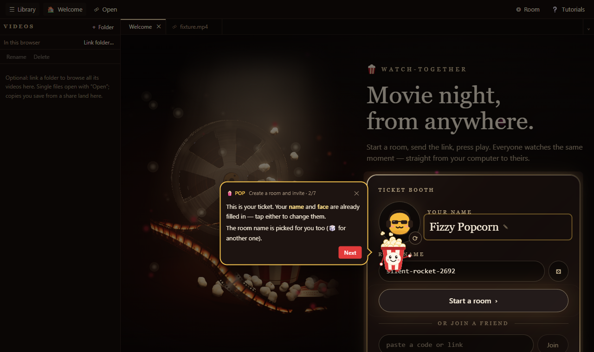

<h1 align="center">easy-tutorial-builder</h1>

<p align="center">
  <strong>Interactive product tours, written as typed, data-only scripts.</strong><br />
  Steps advance on what the user actually does, the spotlight keeps up with moving targets, and a guide of your own
  design does the talking.
</p>

<p align="center">
  <a href="https://www.npmjs.com/package/@theclearsky/easy-tutorial-builder"></a>
  <a href="https://github.com/TheClearSky/easy-tutorial-builder/actions/workflows/library-deploy.yml"></a>
  
  
  
  <a href="./LICENSE"></a>
</p>

<p align="center">
  <a href="https://www.npmjs.com/package/@theclearsky/easy-tutorial-builder">npm</a> ·
  <a href="https://github.com/TheClearSky/easy-tutorial-builder">GitHub</a> ·
  <a href="#quick-start">Quick start</a> ·
  <a href="#recipes">Recipes</a> ·
  <a href="#api-at-a-glance">API</a> ·
  <a href="#launch-from-a-docs-site">Remote launch</a> ·
  <a href="./CHANGELOG.md">Changelog</a>
</p>

<p align="center">
  
  <br />
  <sub>A tour in <a href="https://theclearsky.github.io/watch-together/">watch-together</a>: the library draws the spotlight; the app's own guide, Pop, does the talking.</sub>
</p>

---

## Why

Most tours are a list of "click Next" bubbles pinned to CSS selectors. They break the moment the user does something
unexpected, the layout pans, or an element re-mounts. This library treats a tour as a small state machine your app
already understands:

|                                      |                                                                                                                                                                                                         |
| ------------------------------------ | ------------------------------------------------------------------------------------------------------------------------------------------------------------------------------------------------------- |
| 🎯 **Steps advance on real actions** | A step waits for an app event (`"demo.loaded"`) or a condition — not a Next button. Clicks on the real target get through the spotlight.                                                                |
| 🧭 **Distractions route back**       | "The menu closed → go back to _open the menu_" is just a transition in the script. Timeouts show hints; an optional _Show me_ assist does it for the user.                                              |
| 🔦 **Follows moving targets**        | Targets are re-found every frame, so the spotlight keeps up with pan/zoom canvases (React Flow), re-mounted elements, portals, scrolling and fullscreen. Several holes at once keep submenus clickable. |
| 🧾 **Scripts are data**              | A tutorial only _names_ things your app registered — targets, events, predicates, assists. Typed in TypeScript, validated with zod for JSON, so a script is safe to load from a docs site.              |
| 🎭 **Your guide, your look**         | The library draws only the spotlight. Your speaker — a mascot, a bubble, a voice — renders from one `getView()` snapshot: lines, mood, target rect, buttons.                                            |
| 🌐 **Remote launch**                 | A docs page can open your app in a new tab and start a tutorial over `postMessage`: exact-origin allow-list, nonce, size cap, user consent.                                                             |

It takes ideas from the typed step model and failure reporting of [React Joyride](https://github.com/gilbarbara/react-joyride),
and the framework-free, imperative control of [driver.js](https://github.com/nilbuild/driver.js).

## Install

```sh
npm install @theclearsky/easy-tutorial-builder
```

The core has no dependencies and runs without React. `react` (18+) and `zod` (4) are optional peers, needed only by
the entries that use them.

| Entry                                | What's in it                                                                                                                     |
| ------------------------------------ | -------------------------------------------------------------------------------------------------------------------------------- |
| `@theclearsky/easy-tutorial-builder` | Core: `defineKit`, `defineTutorial`, `createTutorial`, `highlight`, `createProgressStore`, `byTourId`, the spotlight and tracker |
| `…/react`                            | `TutorialProvider`, `useTutorial`, `useTutorialView`                                                                             |
| `…/schema`                           | `parseTutorial`, `tutorialSchema`, `tutorialJsonSchema` — validate JSON scripts (zod)                                            |
| `…/remote`                           | `acceptRemoteTutorials`, `launchTutorial` — start a tutorial sent from another tab                                               |

## Quick start

### 1. Describe your app: a kit

The kit is your app's vocabulary — everything a script is allowed to mention.

```ts
import { byTourId, defineKit } from "@theclearsky/easy-tutorial-builder";

export const kit = defineKit({
  targets: {
    "toolbar.demos": () => byTourId("toolbar.demos"), // <button data-tour="toolbar.demos">
    "menu.item": ({ id }) => document.querySelector(`[data-menu-item="${id}"]`),
  },
  events: ["menu.opened", "menu.closed", "demo.loaded"],
  predicates: { menuOpen: () => !!document.querySelector("[role=menu]") },
  assists: {
    openMenu: () =>
      document
        .querySelector<HTMLElement>('[data-tour="toolbar.demos"]')
        ?.click(),
  },
  capabilities: ["demosMenu"],
});

// Anywhere in your app, whether or not a tutorial is running:
kit.bus.emit("demo.loaded", { id: "piano" });
```

### 2. Write a tutorial: data only

```json
{
  "format": 1,
  "id": "open-piano",
  "revision": 1,
  "title": "Open the piano",
  "requires": ["demosMenu"],
  "steps": [
    {
      "id": "demos",
      "type": "point",
      "target": { "name": "toolbar.demos" },
      "skipIf": { "pred": "menuOpen" },
      "lines": [{ "say": "Click **Demos**.", "mood": "pointing" }],
      "advance": [{ "on": { "event": "menu.opened" }, "goto": "next" }],
      "timeoutMs": 12000,
      "hint": [{ "say": "It's the purple button." }],
      "assist": { "name": "openMenu", "label": "Show me" }
    },
    {
      "id": "piano",
      "type": "point",
      "target": { "name": "menu.item", "args": { "id": "piano" } },
      "lines": [{ "say": "Now pick **Piano**." }],
      "advance": [
        {
          "on": { "event": "demo.loaded", "args": { "id": "piano" } },
          "goto": "next"
        },
        { "on": { "event": "menu.closed" }, "goto": "demos" }
      ]
    },
    {
      "id": "done",
      "type": "end",
      "lines": [{ "say": "That's it!", "mood": "celebrate" }]
    }
  ]
}
```

| Step     | What it does                                                                                                           |
| -------- | ---------------------------------------------------------------------------------------------------------------------- |
| `say`    | The guide talks; the user presses Next.                                                                                |
| `point`  | Spotlight a target and wait for an action: an event (`on`, with argument matching and counts) or a condition (`when`). |
| `choice` | Offer buttons; each goes somewhere.                                                                                    |
| `branch` | Jump on a condition, silently.                                                                                         |
| `end`    | Finish, with an outcome.                                                                                               |

Conditions are `{ pred }`, `{ not }`, `{ all }` and `{ any }` — no expressions, nothing to evaluate. In TypeScript,
`defineTutorial(kit, { … })` turns an unknown name into a type error; for JSON files, `tutorialJsonSchema(kit)` gives
editors autocompletion.

### 3. Run it

```ts
import {
  createProgressStore,
  createTutorial,
} from "@theclearsky/easy-tutorial-builder";
import { parseTutorial } from "@theclearsky/easy-tutorial-builder/schema";

const parsed = parseTutorial(kit, jsonText, { maxBytes: 512_000 });
if (!parsed.ok)
  throw new Error(
    parsed.issues.map((i) => `${i.path}: ${i.message}`).join("\n"),
  );

const tour = createTutorial({
  kit,
  tutorial: parsed.tutorial,
  progress: createProgressStore(localStorage),
});
tour.subscribe(() => renderMyGuide(tour.getView())); // lines, mood, target rect, buttons
tour.on("failure", (failure) => console.warn(failure)); // target_not_found, assist_failed, …
tour.start(); // or tour.resume() from the last checkpoint
```

## Recipes

### React

```tsx
import type { Tutorial } from "@theclearsky/easy-tutorial-builder";
import {
  TutorialProvider,
  useTutorial,
} from "@theclearsky/easy-tutorial-builder/react";

function TourButton({ script }: { script: Tutorial }) {
  const { view, start } = useTutorial();
  return view?.status === "running" ? null : (
    <button onClick={() => start(script)}>Show me around</button>
  );
}

<TutorialProvider kit={kit}>
  <App />
</TutorialProvider>;
```

### Draw your own guide

Everything a speaker needs is in one immutable snapshot, refreshed on every change:

```ts
const view = tour.getView();
view.lines; // what to say now — [{ say, mood }]
view.hint; // extra lines once the step timed out
view.target; // the spotlighted element's rect (follows it every frame)
view.placement; // where you asked the bubble to sit
view.waitingForAction; // a point step: show "your turn…", no Next button
view.canNext;
view.canPrev;
view.options; // the buttons to render
view.assist; // { name, label } → tour.runAssist()
view.nudges; // bumps when the user clicks the dimmed page — wiggle your mascot
```

### Spotlight one thing, no tour

```ts
import { byTourId, highlight } from "@theclearsky/easy-tutorial-builder";

const glow = highlight(() => byTourId("save"));
// later
glow.destroy();
```

### Resume where they left off

`createProgressStore(localStorage)` records finished tutorials (per revision) and the last `checkpoint: true` step.
`tour.resume()` starts from that checkpoint; bump a tutorial's `revision` when its steps change, and old checkpoints
are ignored.

## Launch from a docs site

```ts
// the app, in the FIRST module that runs (before any UI):
import { acceptRemoteTutorials } from "@theclearsky/easy-tutorial-builder/remote";
const remote = acceptRemoteTutorials({
  kit,
  allowedOrigins: ["https://docs.example.com"],
});
remote.onRequest((request) =>
  askTheUser(request).then((yes) =>
    remote.respond(request.requestId, yes ? "accept" : { reject: "declined" }),
  ),
);

// the docs site, inside a click handler:
import { launchTutorial } from "@theclearsky/easy-tutorial-builder/remote";
const result = await launchTutorial({
  appUrl: "https://app.example.com/",
  script,
});
// → accepted | rejected{reason} | blocked | no-opener | closed | timeout
```

**The app speaks first.** It announces `ready` only after its listener is installed, and repeats it; the docs site
listens before it opens the app and only ever replies — no message is ever sent to a listener that doesn't exist yet.

The receiver checks that:

- the sender's origin exactly matches the allow-list, and the sender is the window that opened the app;
- a one-time nonce is used, one request per page load, within a 60&nbsp;s window;
- the size fits before parsing (512&nbsp;KB by default), the script passes schema validation, and the app has every
  capability it requires;
- the app is not inside a frame.

The request is queued in `sessionStorage`, so it survives reloads and a "click to start" gate. The app only ever sends
back `ready`, `accepted` or `rejected` with a reason code.

## API at a glance

| Export                                                    | What it does                                                                                                                                                                                                                                                                                                   |
| --------------------------------------------------------- | -------------------------------------------------------------------------------------------------------------------------------------------------------------------------------------------------------------------------------------------------------------------------------------------------------------- |
| `defineKit(definition)`                                   | Your app's vocabulary: `targets`, `events` (with an event `bus`), `predicates`, `assists`, `capabilities`.                                                                                                                                                                                                     |
| `defineTutorial(kit, script)`                             | A script typed against the kit (unknown names are type errors).                                                                                                                                                                                                                                                |
| `createTutorial(options)`                                 | The controller: `start`, `resume`, `next`, `prev`, `goTo`, `choose`, `skip`, `runAssist`, `getView`, `subscribe`, `on('step' \| 'finish' \| 'failure' \| 'outside')`, `destroy`. Options: `spotlight` (or `false`), `outsideClick` (`block` / `pass` / `skip`), `dimWhileTalking`, `targetWaitMs`, `progress`. |
| `highlight(find, options?)`                               | A one-off spotlight that tracks its element.                                                                                                                                                                                                                                                                   |
| `createProgressStore(storage)`                            | Completion per revision + resume checkpoints.                                                                                                                                                                                                                                                                  |
| `byTourId(id, root?)`                                     | The element with `data-tour="id"` (CSS-escaped), or `null`.                                                                                                                                                                                                                                                    |
| `parseTutorial` · `tutorialSchema` · `tutorialJsonSchema` | Validate untrusted JSON with exact error paths and size limits; a JSON Schema for editors.                                                                                                                                                                                                                     |
| `acceptRemoteTutorials` · `launchTutorial`                | Remote launch, both ends.                                                                                                                                                                                                                                                                                      |
| `createSpotlight` · `createTracker` · `engineReducer`     | The building blocks, for custom renderers and tests.                                                                                                                                                                                                                                                           |

## Built to be trusted

- **Framework-free core, zero dependencies**, ~7&nbsp;KB gzip; React and zod only where you import them.
- **25 tests** cover the engine's transitions (events with argument matching and counts, `skipIf` on entry and
  while waiting, branches, cycle guards), the controller, schema validation (unknown names, exact error paths,
  size limits) and the remote-launch handshake.
- Used in production apps with pan/zoom canvases, portals and fullscreen video — the cases tours usually break on.
- Releases after 0.0.1 are built and published by CI with npm provenance.

## Used by

| Project                                                                                                                                                                                       | Guide                       |
| --------------------------------------------------------------------------------------------------------------------------------------------------------------------------------------------- | --------------------------- |
| **[watch-together](https://theclearsky.github.io/watch-together/)** — watch local videos together, peer to peer, from a static page ([source](https://github.com/TheClearSky/watch-together)) | **Pop**, a popcorn bucket   |
| **Nodestra** — a node-based sound design app, where this library was born                                                                                                                     | **Blip**, a small conductor |

Its sibling, **[easy-folder-management-ui](https://github.com/TheClearSky/easy-folder-management-ui)** ([npm](https://www.npmjs.com/package/@theclearsky/easy-folder-management-ui)),
gives web apps a VS Code-style file library and tab strip; both libraries came out of the same apps.

## License

MIT © 2026 Deepak Prasad
